|  | Algorithm and Data Structure |
|--|--|
| NIM |  244107020038|
| Nama |  Nayla Akas Oktavia|
| Kelas | TI - 1H |
| Repository | [link] () |

# Review Dasar Pemrograman 
#  Praktikum
## 2.2.1 Pemilihan

berikut merupakan hasil running dari praktikum pemilihan:

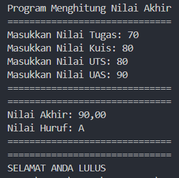

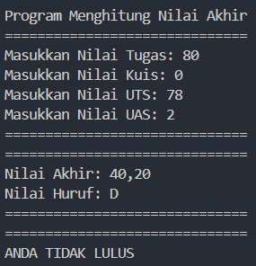

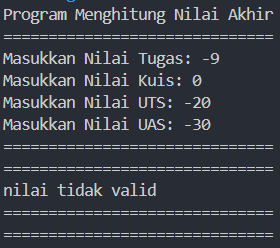

*Penjelasan :* 
1. Input nilai tugas, kuis, uts, dan uas
2. Dilakukan pengecekan apakah nilai yang diinput merupakan nilai yang valid
3. JIka nilai tidak valid akan muncul pemberitahuan "milai tidak valid". Jika seluruh nilai valid, maka nilai akan diproses dan akan dikonversi ke dalam nilai huruf
4. Lalu menampilkan apakah mahasiswa tersebut LULUS/TIDAK LULUS

## 2.3.1 Perulangan

berikut merupakan hasil running dari praktikum perulangan:

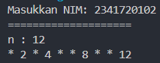

*Penjelasan :* 
1. Input NIM
2. Mengambil 2 digit terakhir dari NIM yang telah diinput
3. Dilakukan pengecekan apakah 2 digit tersebut < 10 atau tidak. Jika < 10 maka angka akan ditambahkan 10
4. Angka 6 dan 10 tidak dicetak
5. Angka ganjil dicetak dengan asteriks(*), angka genap dicetak sesuai bilangan asli

## 2.4.1 Array

berikut merupakan hasil running dari praktikum array:

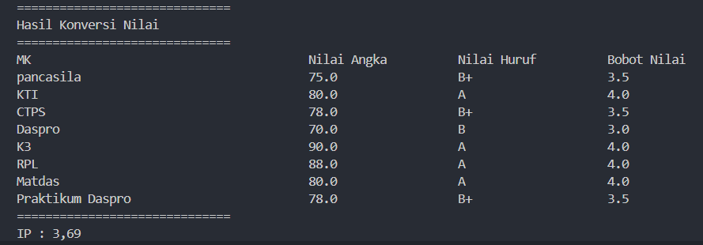

*Penjelasan :* 
1. Membuat array untuk menyimpan data yang telah diinput
2. Menginputkan nama matkul, nilai angka, dan juga bobot SKS Matkul 
3. Mengkonversi Nilai angka menjadi Nilai huruf
4. Mengolah data untuk mendapatkan IP semester
5. Menampilkan hasil konversi nilai mahasiswa dan IP semester 

## 2.5.1 Fungsi

berikut merupakan hasil running dari praktikum fungsi:

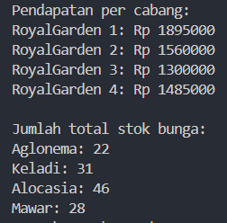

*Penjelasan :* 
1. Menginisialisasikan array yang berisikan stok dan harga bunga yang dijual
2. Menghitung pendapatan per cabang dan menampilkan pendapatan per cabang
4. Menghitung jumlah dan menampilkan stok tiap bunga

# Tugas

berikut hasiil running tugas:
## 1. 
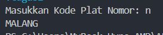

*Penjelasan :*
1. Membuat dua array, satu dimensi dan dua dimensi. Array atu dimensi untuk kode plat nomor, array dua dimensi untuk nama kota
2. Menginputkan kode plat nomor
3. Pengecekan kode plat yang diinput dengan data kode plat yang tersimpan
4. Menampilkan nama kota sesuai kode plat yang diinput

## 2.
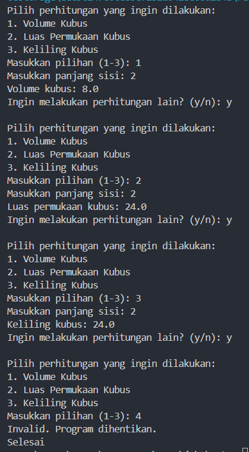

*Penjelasan :*
1. Menampilkan menu pilihan
2. Menginput pilihan 
3. Memanggil fungsi sesuai piliihan yang diinput
- volume kubus
- luas permukaan kubus
- keliling kubus
4. Menginput panjang sisi
5. Memproses perhitungan sesuai pilihan yang dipilih
6. Menampilkan hasil hitungan
7. Ulangi/keluar 

## 3.
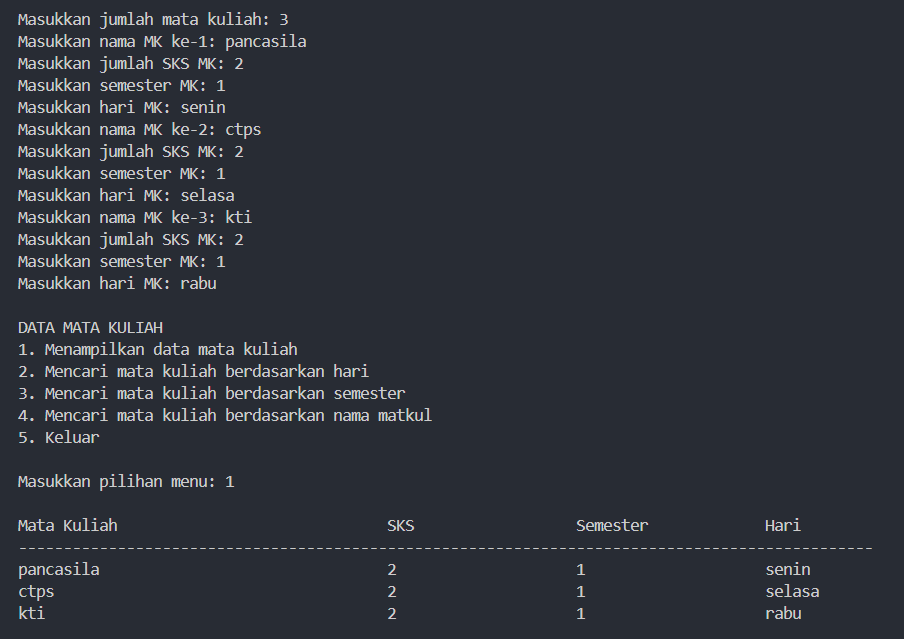

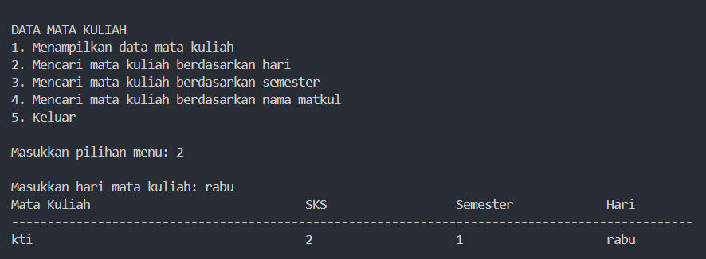

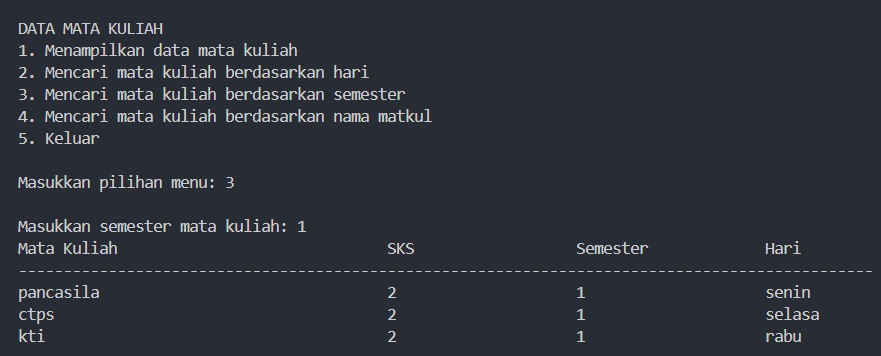

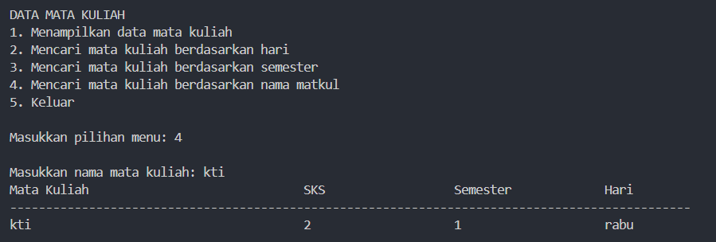

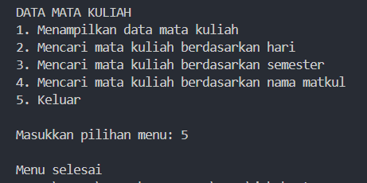

*penjelasan :*
1. Menginputkan data mata kuliah
2. Menampilkan menu pilihan
3. input pilihan
4. memanggil fungsi sesuai pilihan yang diinput
5. ulangi/keluar