|  | Algorithm and Data Structure |
|--|--|
| NIM |  244107020038|
| Nama |  Nayla Akas Oktavia|
| Kelas | TI - 1H |
| Repository | [link] () |

# Jobsheet 10 - QUEUE
## Percobaan 1: Operasi Dasar Queue

berikut merupakan hasil running dari percobaan 1:

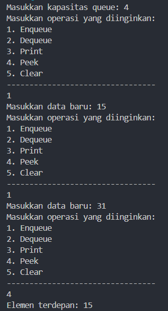 

*Jawaban Pertanyaan:* 

1. Nilai -1 untuk ```front``` dan ```rear``` untuk menandakan bahwa antrian masih kosong. ```Size``` berfungsi untuk menyimpan elemen dalam antrian. ```Size``` bernilai 0 menandakan belum ada elemen di dalam antrian, saat antrian baru dibuat.

2. Kode ini adalah bagian dari implementasi circular queue. Kode tersebut berguna untuk mengembalikan ```rear``` (belakang) ke awal yaitu 0, ketika rear sudah mencapai akhir array (max - 1). Jadi jika ada elemen baru, maka akan dimasukkan ke awal array jika ada ruang.

3.  Kode ini adalah bagian dari implementasi circular queue. Kode ini memeriksa apakah ```front``` (posisi elemen paling depan dalam antrian yang akan dihapus) telah mencapai akhir array (max - 1). Jika ya, maka front diatur ulang ke 0, yang berarti ia bergerak kembali ke awal array.

4. Variabel ```i``` diinisialisasikan dengan ```front``` karena atrian yang diimplementasikan adalah antrian melingkar (circular queue). Jadi ```front``` selalu menunjuk ke elemen pertama (paling depan) dalam antrian.

5. Penggunaan ```i = (i + 1) % max;``` memastikan bahwa indeks ```i``` kembali ke 0 setelah mencapai indeks maksimum (max). Ketika ```i + 1``` adalah max, maka ```(i + 1) % max;``` akan menghasilkan 0. Ini berarti indeks ```i``` akan kembali ke awal array (indeks 0)

6. Dengan adanya pengecekan ```isFull()``` di method ```Enqueue```, program dapat mendeteksi kondisi queue oveflow
```java
if (isFull()) {
    System.out.println("Queue sudah penuh");
}
```

7. Menambahkan kode ```System.exit(0);``` pada method ```Enqueue```
```java
if (isFull()) {
    System.out.println("Queue sudah penuh");
    System.exit(0);
}
```
dan pada method ```Dequeue``` juga
```java
if (isEmpty()) {
    System.out.println("Queue masih kosong");
    System.exit(0);
}
```
hasil:

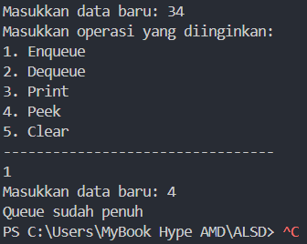

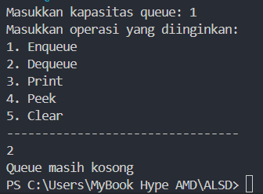

## Percobaan 2: Antrian Layanan Akademik

berikut merupakan hasil running dari percobaan 2:

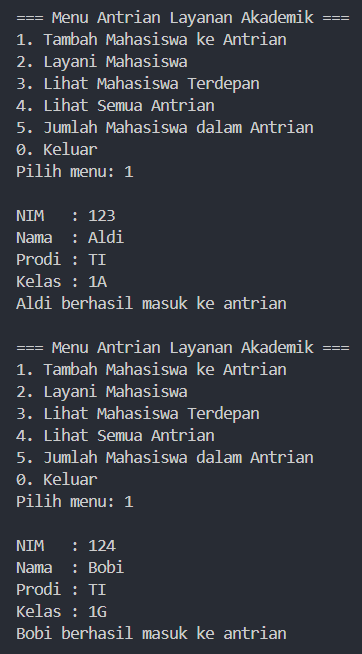

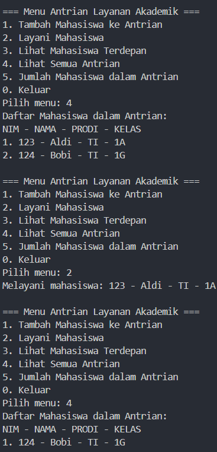

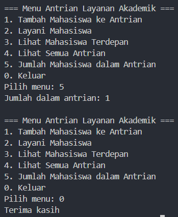

*Jawaban Pertanyaan:*

Modif program dengan menambahkan method ```lihatAkhir``` pada class ```AntrianLayanan```. Kode programnya sama dengan method ```lihatTerdepan``` hanya saja diganti pada bagian ```data[front].tampilData()``` menjadi ```data[rear].tampilData()``` karena data mahasiswa yang akan ditampilkan adalah data yang paling belakang atau terakhir dimasukkan.
```java
public void lihatAkhir() {
        if (isEmpty()) {
            System.out.println("Antrian kosong");
        }
        else {
            System.out.println("Mahasiswa terakhir: ");
            System.out.println("NIM - NAMA - PRODI - KELAS");
            data[rear].tampilkanData();
        }
    }
```
 Tidak lupa menambahkan menu dan case di class ```LayananAkademikSIAKAD```
 ```java
 case 6:
    antrian.lihatAkhir();
    break;
 ```
hasil:

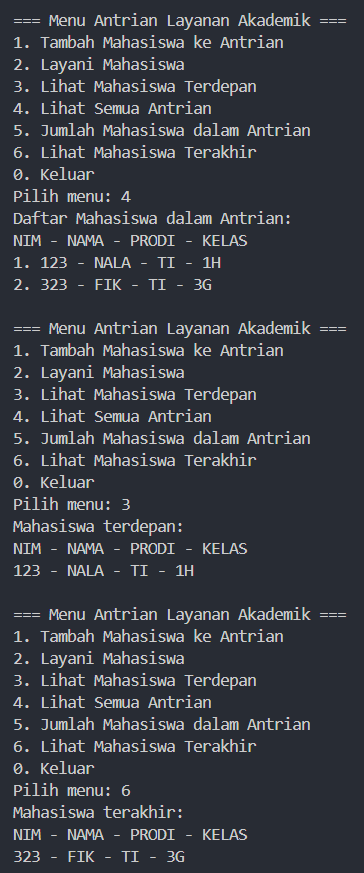

# Latihan

Membuat program antrian untuk antrian persetujuan KRS mahasiswa oleh DPA. 
berikut hasil running latihan:

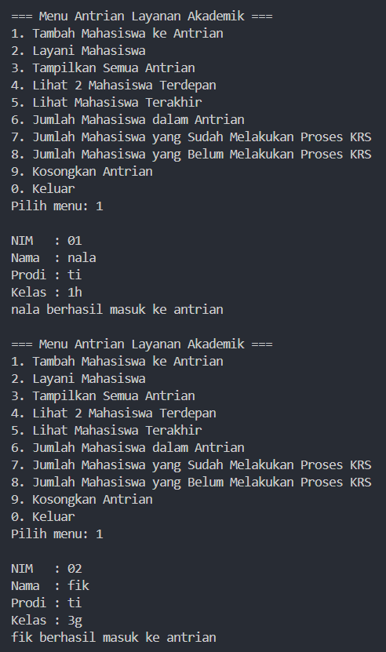

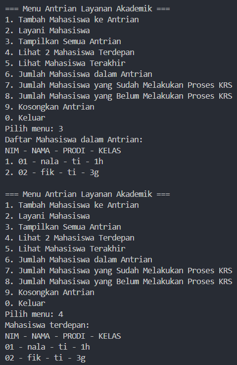

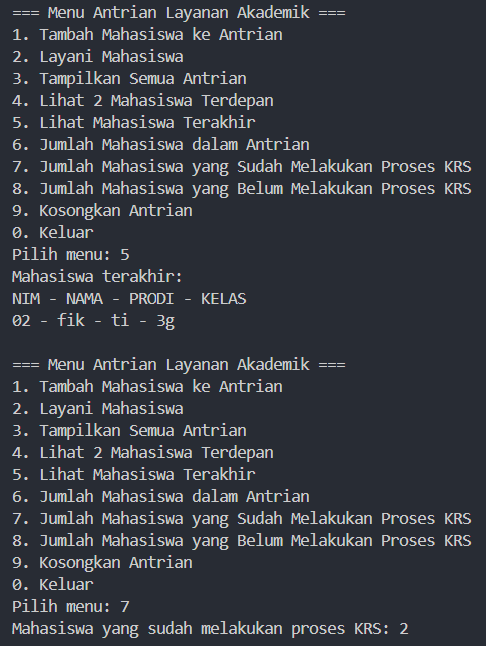

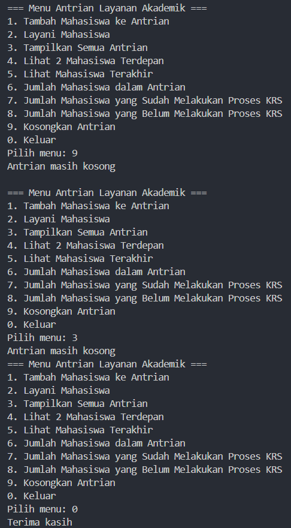


