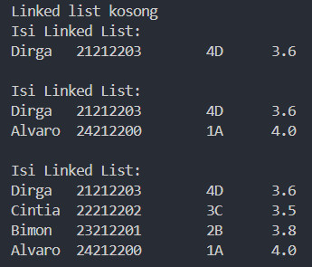
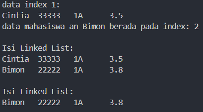
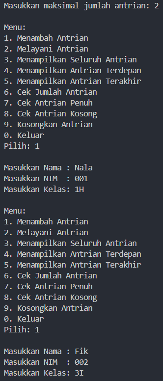
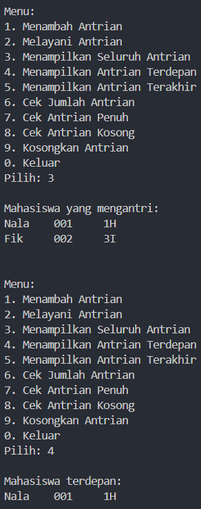
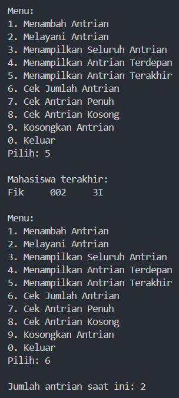
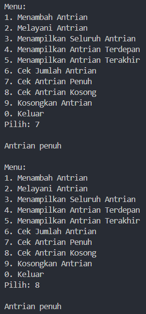
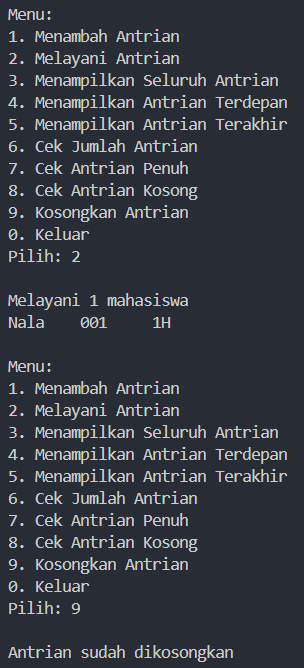

|  | Algorithm and Data Structure |
|--|--|
| NIM |  244107020038|
| Nama |  Nayla Akas Oktavia|
| Kelas | TI - 1H |
| Repository | [link] (https://github.com/naylaakas/ALSD/tree/main/jobsheet11) |

# Jobsheet 11 - SINGLE LINKED LIST
## Percobaan 1: Pembuatan Single Linked List

berikut merupakan hasil running dari percobaan 1:



*Jawaban Pertanyaan:* 

1. Karena di awal, linked list masih kosong atau belum ada data yang ditambahkan

2. Pada method ```print()```, ```temp``` digunakan untuk menelusuri setiap node dalam linked list dan mencetak data atau infromasi mahasiswa saat memanggil method ```tampilInformasi()```. Pada method ```insertAfter```, ```temp``` digunakan untuk mencari node yang datanya cocok dengan ```key```(nama mahasiswa), jika sudah ditemukan maka node baru (```ndInput```) akan disisipkan  setelah node yang ditemukan

3. Melakukan modifikasi di class ```SLLMain```, dengan menambahkan ```Scanner``` agar bisa memasukkan input dari user

## Percobaan 2: Elemen pada Single Linked List

berikut merupakan hasil running dari percobaan 2:



*Jawaban Pertanyaan:*

1. Digunakan ```break``` agar dapat menghentikan pencarian lebih lanjut dalam linked list setelah node yang ingin dihapus sudah ditemukan dan dihapus

2. Di baris pertama, digunakan untuk melompati node yang dihapus, sehingga node sebelumnya(```temp```) sekarang menunjuk ke node setelah node yang dihapus. Di baris kedua, digunakan untuk memperbarui tail jika node yang dihapus adalah node terakhir

# Latihan

Membuat program antrian layanan unit kemahasiswaan

Membuat class ```Mhs``` untuk menampung data mahasiswa dengan atribut NIM, Nama, dan kelas

Membuat class ```NodeMhs``` yang merupakan implementasi dari sebuah node dalam struktur data linked list yang digunakan untuk menyimpan data mahasiswa

Membuat class ```AntrianLayanan``` untuk menangani antrian layanan mahasiswa

Membuat class ```AntrianLayananMain``` untuk menangani input dan output dari program antrian layanan mahasiswa

berikut hasil running latihan:












