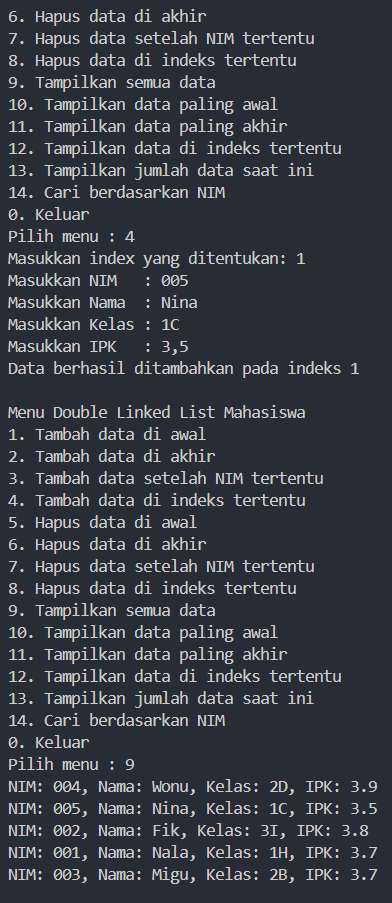

|  | Algorithm and Data Structure |
|--|--|
| NIM |  244107020038|
| Nama |  Nayla Akas Oktavia|
| Kelas | TI - 1H |
| Repository | [link] (https://github.com/naylaakas/ALSD/tree/main/jobsheet12) |

# Jobsheet 12 - DOUBLE LINKED LIST
## Percobaan 1

Ikuti langkah-langkah yang ada pada jobsheet 12 percobaan 1. 
berikut merupakan hasil running dari percobaan 1:


*Jawaban Pertanyaan:* 

1.  Single: tiap node hanya menunjuk ke node berikutnya (next)
    Double: tiap node menunjuk ke node berikutnya (next) dan sebelumnya (prev)

2.  Next: Untuk penunjuk ke node selanjutnya
    Prev: Untuk penunjuk ke node sebelumnya

3. Untuk menginisialisasi objek double linked list dalam keadaan kosong

4. Jika linked list masih kosong, maka newNode akan menjadi head sekaligus tail

5. Menghubungkan node lama (yang sebelumnya menjadi head) ke newNode sebagai node sebelumnya (prev)

6. Modifikasi dengan menambahkan kondisi pada fungsi ```print()```
```java
public void print() {
        if (!isEmpty()) {
            Node21 current = head;
            while (current != null) {
                current.data.tampil();
                current = current.next;
            }
            System.out.println("");
        }
        else {
            System.out.println("Linked list masih kosong");
        }
    }
```

7. Potongan kode tersebut digunakan untuk menghubungkan node baru ke node yang sebelumnya berada setelah current

8. Modifikasi menu pilihan dan switch-case agar fungsi ```insertAfter()``` masuk ke dalam menu pilihan

## Percobaan 2

Ikuti langkah-langkah yang ada pada jobsheet 12 percobaan 2.
berikut merupakan hasil running dari percobaan 2:


*Jawaban Pertanyaan:*

1. ```head = head.next;``` digunakan untuk menggeser head ke node berikutnya. 

    ```head.prev = null;``` digunakan untuk memutus hubungan ke node sebelumnya dari node yang baru menjadi head. Karena node ini sekarang menjadi yang paling awal di list, makka prev harus null

2. Modfikasi pada method ```removeFirst()``` dan ```removeLast()``` agar menampilkan pesan jika berhasil menghapus data

# Latihan

Menambahkan  fungsi ```add()```, Menambahkan ```removeAfter()```, Menambahkan fungsi ```remove()```, Menambahkan fungsi ```getFirst()```, ```getLast()```, ```getIndex()```, Menambahkan fungsi ```size()```

berikut hasil running latihan:

Data awal:


1. Fungsi add()



2. Fungsi removeAfter()


3. Fungsi remove() 


4. Fungsi getFirst()


5. Fungsi getLast()


6. Fungsi getIndex()


7. Fungsi getSize()


