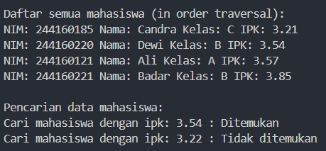
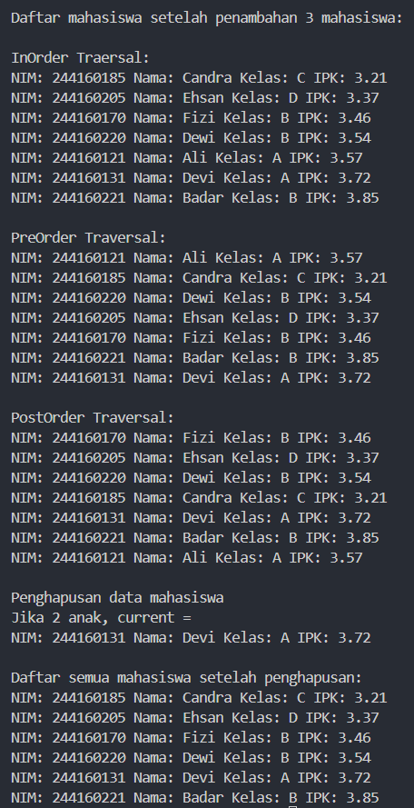
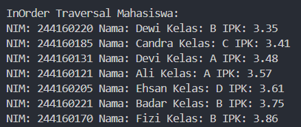
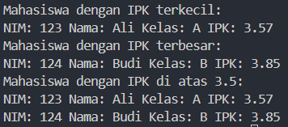
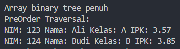

|  | Algorithm and Data Structure |
|--|--|
| NIM |  244107020038|
| Nama |  Nayla Akas Oktavia|
| Kelas | TI - 1H |
| Repository | [link] (https://github.com/naylaakas/ALSD/tree/main/jobsheet13) |

# Jobsheet 13 - TREE
## Percobaan 1

Ikuti langkah-langkah yang ada pada jobsheet 13 percobaan 1. 
berikut merupakan hasil running dari percobaan 1:





*Jawaban Pertanyaan:* 

1. Karena memiliki struktur yang terurut, sehingga pencarian bisa diarahkan (tidak harus menelusuri semuanya)

2.  Left: menunjuk ke simpul anak sebelah kiri dari node saat ini
    Right: menunjuk ke simpul anak sebelah kanan dari node saat ini

3.  a. Sebagai titik awal (akar) dari struktur pohon biner

    b. Nilainya adalah null

4. Jika masih kosong, maka node pertama yang ditambahkan akan menjadi root dan tidak perlu dilakukan pembandingan ke kiri atau kanan karena belum ada simpul lain

5.  ```parent = current``` digunakan untuk menyimpan node saat ini ke dalam variabel parent

    ```if (mahasiswa.ipk < current.mahasiswa.ipk)``` digunakan untuk membandingkan nilai IPK mahasiswa baru dengan IPK saat ini, jika lebih kecil maka harus disisipkan di subtree kiri

    ```current = current.left``` pindah ke node nak kiri

    ```if (current == null) { parent.left = newNode; return; }``` jika anak kiri kosong, maka newNode disisipkan sebagai anak kiri dari parent

    ```else { current = current.right; ... }``` jika IPK baru lebih besar atau sama, maka pindah ke kanan

    Proses selanjutnya sama seperti langkah sebelumnya. Proses akan terus berulang, bergerak ke kiri atau ke kanan sesuai nilai IPK. Sampai menemukan tempat kosong (null), lalu node baru disisipkan


6. Saat menghapus node dengan dua anak di BST, node tersebut diganti dengan inOrder seccessor, agar urutan BST tetap terjaga. Method ```getSuccsessor``` membantu menemukan node pengganti tersebut, serta mengatur koneksi antar node agar struktur pohon tetap benar

## Percobaan 2

Ikuti langkah-langkah yang ada pada jobsheet 13 percobaan 2.
Berikut merupakan hasil running dari percobaan 2:



*Jawaban Pertanyaan:*

1. `dataMahasiswa` adalah array yang menyimppan semuda data mahasiswa.
`idxLast` adalah indeks terakhir yang berisi data valid dalam array.

2.  a. Mengisi array dataMahasiswa

    b. Menanddai posisi terakhir data pada nilai idxLast

    c. Inisialisasi data sebelum operasi traversal

3.  a. Menampilkan data mahasiswa

    b. Menuggunakan rekursi untuk mengakses seleuruh node

4. Jika suatu node berada di inddeks s, maka:
- Left child: 2*s + 1
- Right child: 2*s + 2
- Parent: (s-1)/2

5.  a. Menandai data terakhir beradai di indeks 6

    b. Membatasi data yang harus dimasukkan ke array

6. Untuk menyimpan tree dalam bentuk array.

- Anak kiri dari node di indeks i ada di 2*i + 1

- Anak kanan ada di 2*i + 2

    Contoh:
Kalau Ali di indeks 0, maka:

- Anak kiri = indeks 1

- Anak kanan = indeks 2


# Latihan

berikut hasil running latihan:



