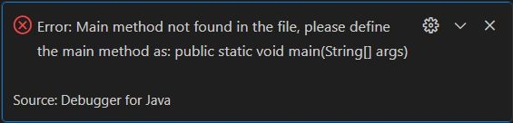
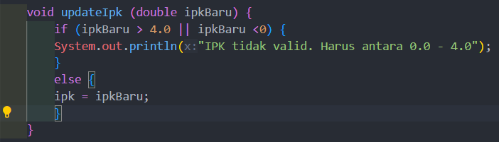
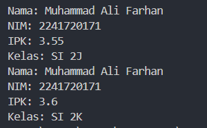
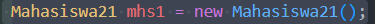
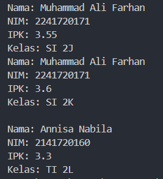
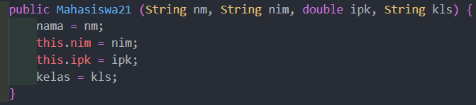
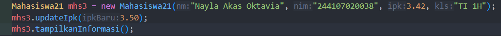
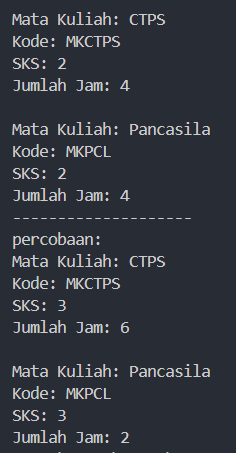
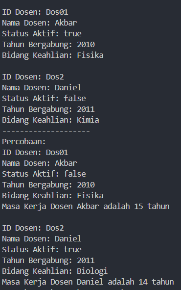

|  | Algorithm and Data Structure |
|--|--|
| NIM |  244107020038|
| Nama |  Nayla Akas Oktavia|
| Kelas | TI - 1H |
| Repository | [link] () |

# Jobsheet 2 - Object
## Percobaan 1: Deklarasi Class, Atribut dan Method

berikut merupakan hasil running dari praktikum percobaan 1:

*Jawaban Pertanyaan:* 
1.  Class: blueprint atau template, atribut (data)
    Object: behavior, state
2.  Atribut yang dimiliki ada empat, yaitu: nama, nim, kelas, ipk
3.  Method yang dimiliki ada tiga, yaitu: tampilkanInformasi, ubahKelas, updateIpk
4. 
5. Method tersebut mengevaluasi kinerja mahasiswa berdasarkan IPK. Kriteria yang digunakan adalah nilai IPK yang didapat oleh mahasiswa, rentang nilai IPK dibagi menjadi 4 kategori kinerja yaitu sangat baik, baik, cukup, dan kurang

## Percobaan 2: Instansiasi Object, serta Mengakses Atribut dan Method

berikut merupakan hasil running dari percobaan 2:

*Jawaban Pertanyaan:* 
1. 

    nama object yang dihasilkan adalah mhs1
2. Untuk mengakses atribut dan method dari suatu objek, kita menggunakan operator titik (.)
    - mengakses atribut:
    namaObject.namaAtribut = nilai;
    - mengakses method:
    namaObject.namaMethod();
3. Karena telah dilakukan ubah kelas dan update IPK 

## Percobaan 3: Membuat Konstruktor

berikut merupakan hasil running dari percobaan 3:

*Jawaban Pertanyaan:* 
1. 
2. Membuat dan menginisialisasi sebuah objek Mahasiswa bernama mhs2 dengan data yang telah ditentukan
3. error. Karena jika dihapus, konstruktor berparameter akan otomatis menjadi konstruktor default, sehingga saat instansiasi objek harus mengisi parameter
4. Tidak, method class mahasiswa bisa diakses secara acak ataupun berurutan karena tidak butuh data dari method lain untuk jalan
5. 

# Latihan

berikut hasil running tugas:
## 1. Matkul

## 2. Dosen

