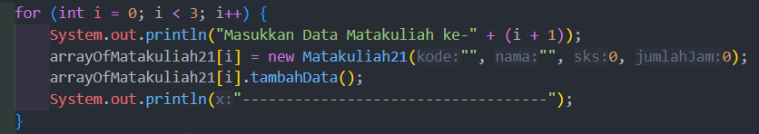

|  | Algorithm and Data Structure |
|--|--|
| NIM |  244107020038|
| Nama |  Nayla Akas Oktavia|
| Kelas | TI - 1H |
| Repository | [link] (https://github.com/naylaakas/ALSD/tree/main/jobsheet3) |

# Jobsheet 3 - Array of Object
## Percobaan 1: Membuat Array dari Object, Mengisi dan Menampilkan

berikut merupakan hasil running dari percobaan 1:

*Jawaban Pertanyaan:* 
1. Tidak, class yang akan dibuat array of object tidak selalu memiliki atribut dan method sekaligus. Class bisa memiliki hanya atribut, hanya method, atau keduanya sesuai dengan kebutuhan dan tujuan class
2. Membuat array arrayOfMahasiswa yang dapat menampung tiga objek Mahasiswa
3. Tidak memiliki. Bisa dilakukan pemanggilan konstruktor karena pada java, jika tidak memiliki konstruktor yang didefinisikan maka kompiler java akan otomatis menyediakan konstruktor default
4. Menginstansiasi objek Mahasiswa pada array arrayOfMahasiswa
5. Untuk membedakan kegunaan masing-masing. Class Mahasiswa untuk menyimpan informasi-informasi terkait mahasiswa, sementara itu class MahasiswaDemo digunakan untuk memanggil class Mahasiswa menggunakan atribut, serta method yang ada di class Mahasiswa

## Percobaan 2: Menerima Input Isian Array Menggunakan Looping

berikut merupakan hasil running dari percobaan 2:

*Jawaban Pertanyaan:* 
1.  - menambahkan cetakInfo()

    
    - modif kode program pada MahasiswaDemo
    
    
2.  Error karena tidak dilakukan instansiasi

## Percobaan 3: Konstruktor Berparameter

berikut merupakan hasil running dari percobaan 3:

- Hasil run sebelum modif

- Hasil run setelah modif

*Jawaban Pertanyaan:* 
1. Iya, suatu class bisa memiliki lebih dari satu konstruktor

2. - pada class matakuliah

   - pada class matakuliahDemo

3. - pada class matakuliah

   - pada class matakuliahDemo

4. 

# Tugas
berikut hasil running tugas:
## 1. Dosen 

## 2. Data Dosen
.png)
.png)