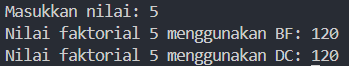
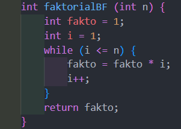
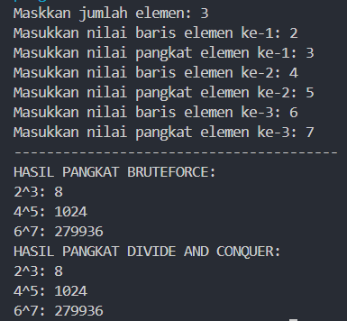
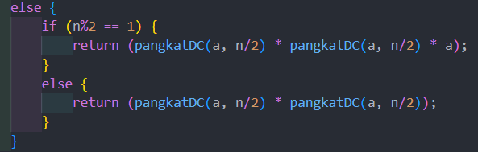
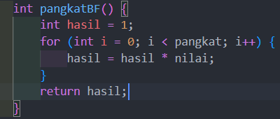
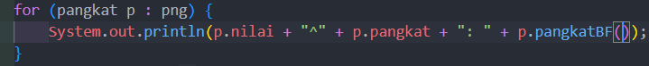
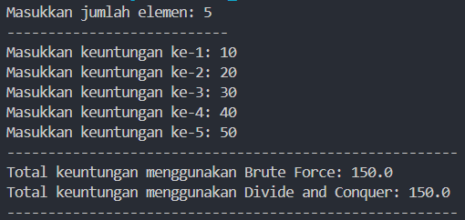
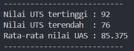

|  | Algorithm and Data Structure |
|--|--|
| NIM |  244107020038|
| Nama |  Nayla Akas Oktavia|
| Kelas | TI - 1H |
| Repository | [link] () |

# Jobsheet 5 - Brute Force and Divide Conquer
## Percobaan 1: Menghitung Nilai Faktorial dengan Algoritma Brute Force dan Divide and Conquer

berikut merupakan hasil running dari percobaan 1:

*Jawaban Pertanyaan:* 
1. if merupakan base case dari rekursif, digunakan untuk menentukan kapan proses rekursi berhenti. Sedangkan else adalah bagian rekursif, digunakan untuk memecah masalah menjadi sub yang lebih kecil
2. Memungkinkan,

3. Perbedaannya terletak pada cara perhitungan faktorial yang dilakukan oleh kedua method yang berbeda. Pada method faktorialBF() menggunakan pendekatan iteratif dengan fakto *= i, sedangkan faktorialDC() menggunakan pendekatan rekursif dengan fakto = n * faktorialDC(n-1);
4.  - faktorialBF() menggunakan pendekatan iteratif dengan perulangan, 
    - faktorialDC() menggunakan pendekatan rekursif yaitu fungsi memanggil dirinya sendiri

## Percobaan 2: Menghitung Hasil Pangkat dengan Algoritma Brute Force dan Divide and Conquer

berikut merupakan hasil running dari percobaan 2:

*Jawaban Pertanyaan:* 
1. pangkatBF() menggunakan pendekatan iteratif, sedangkan pangkatDC() menggunakan pendekatan rekursif dengan pembagian
2. sudah, 

3. method pangkatBF() dapat dibuat tanpa parameter karena sudah memiliki atribut yang menyimpan nilai dan pangkat di class pangkat
- mengganti di class pangkat

- mengganti di class mainpangkat

4.  - pangkatBF() menggunakan perulangan. Variabel hasil diinisialisasi dengan satu. Perulangan berjalan sebanyak n kali. Setiap iterasi, hasil dikali dengan a. Setelah perulangan selesai, hasil akan berisi a pangkat n
    - pangkatDC() menggunakan pendekatan rekursif dan membagi masalah menjadi sub yang ebih kecil. Jika n adalah 1, maka hasilnya adalah a. Jika n genap, ia menghitung pangkatDC(a, n/2) dua kali dan mengalikan hasilnya. Jika n ganjil, ia juga menghitung pangkatDC(a, n/2) dua kali, tetapi mengalikan hasilnya dengan a tambahan

## Percobaan 3: Menghitung Sum Array dengan Algoritma Brute Force dan Divide and Conquer

berikut merupakan hasil running dari percobaan 3:

*Jawaban Pertanyaan:* 
1. untuk membagi array menjadi 2 bagian lebih kecil yang sama besar dan secara tdak langsung juga membatasi proses rekursif
2. menghitung total sub array kiri dan sub array kanan
3. penjumlahan tersebut merupakan proses combine, yaitu penggabungan sub masalah agar mendapat solusi. Jadi, penjumlahan tersebut untuk mengetahui total keseluruhan array
4. saat kondisi indeks kiri(l) sama dengan indeks kanan(r) pada 

        if (l == r) {    
            return arr[l];
        }
5. array dibagi menjadi 2 bagian lebih kecil, menyelesaikan setiap bagian menggunakan proses rekursif hingga mencapai base case, kemudian menggabungkan hasil kedua bagian agar mendapat total keseluruhan array

# Latihan
berikut hasil running latihan:

