|  | Algorithm and Data Structure |
|--|--|
| NIM |  244107020038|
| Nama |  Nayla Akas Oktavia|
| Kelas | TI - 1H |
| Repository | [link] (https://github.com/naylaakas/ALSD/tree/main/jobsheet6) |

# Jobsheet 6 - Sorting (Bubble, Selection, dan Insertion Sort)
## Percobaan 1: Mengimplementasikan Sorting menggunakan object

berikut merupakan hasil running dari percobaan 1:

a. Sorting - Bubble Sort
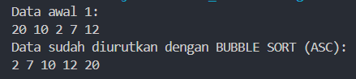

b. Sorting - Selection Sort
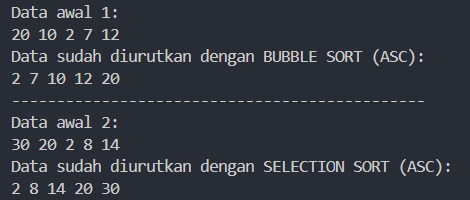

c. Sorting - Insertion Sort
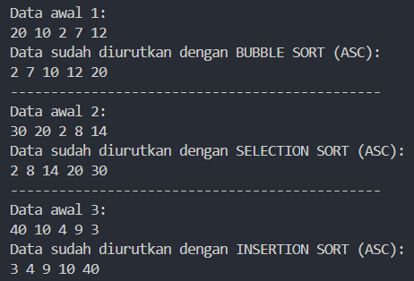

*Jawaban Pertanyaan:* 
1. berfungsi untuk membandingkan dua elemen yang berdekatan dalam sebuah array (data[j-1] dan data[j]) dan menukar posisinya jika elemen pertama lebih besar dari elemen kedua. Tujuannya untuk mengurutkan array dalam urutan ascending
2. 
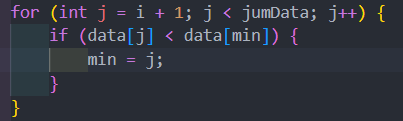

3. untuk menemukan posisi yang tepat untuk elemen temp di bagian array yang sudah diurutkan
4. untuk menggeser elemen yang lebih besar dari elemen yang sedang disisipkan satu posisi ke kanan. Tujuannya adalah untuk membuat ruang kosong di posisi yang tepat untuk elemen temp

## Percobaan 2: Sorting menggunakan Array of Object

berikut merupakan hasil running dari percobaan 2:
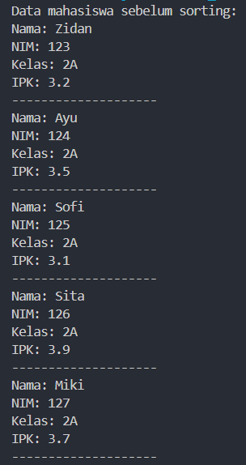

A. Sorting - Bubble Sort
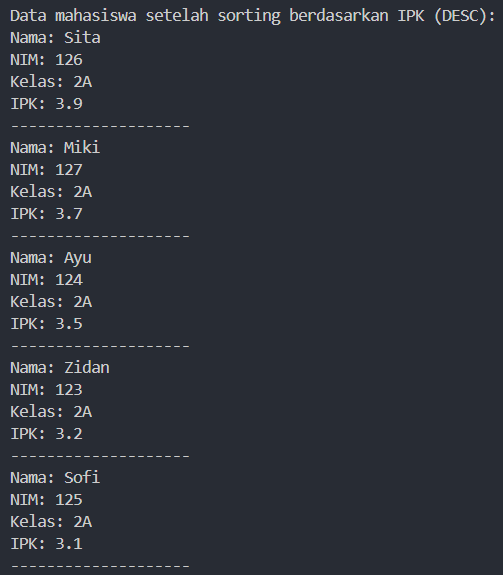
*Jawaban Pertanyaan:* 

1.  a. untuk memastikan bahwa perulangan luar hanya berjalan sebanyak yang diperlukan untuk mengurutkan array, dan mencegah kesalahan akses di luar batas array

    b. untuk memastikan bahwa perulangan dalam hanya membandingkan elemen-elemen yang belum berada di posisi yang benar

    c. 49 kali perulangan dan menempuh 49 tahap bubble sort
2. 
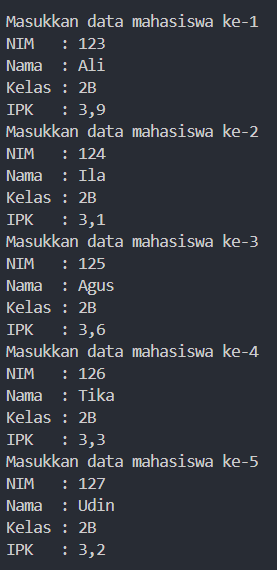
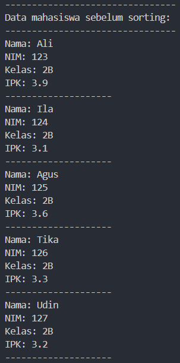
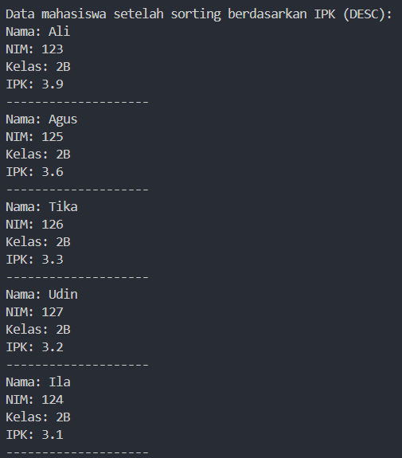

B. Sorting - Selection Sort
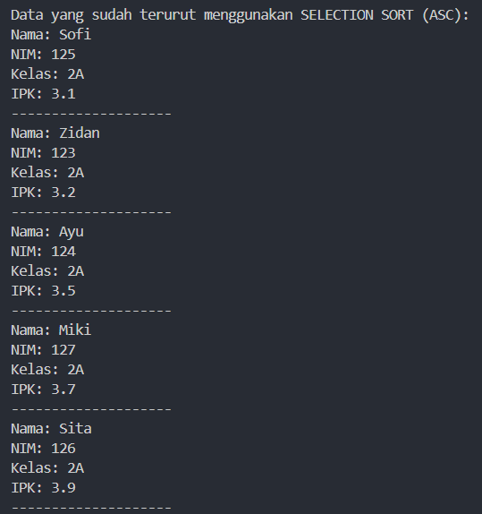
*Jawaban Pertanyaan:*

Proses tersebut dilakukan untuk menemukan elemen terkecil dalam sub array. Setelah elemen terkecil ditemukan, algoritma selection sort akan menukar elemen tersebut dengan elmen pada i, kemudian proses ini terus berulang hingga seluruh array terurut.

C. Sorting - Insertion Sort
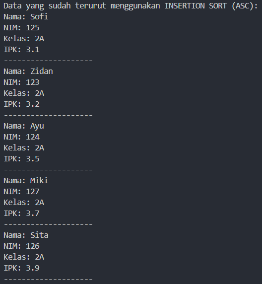
*Jawaban Pertanyaan:*
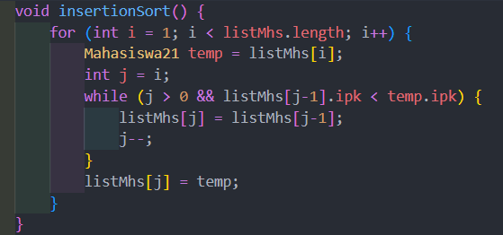

# Latihan
berikut hasil running latihan:

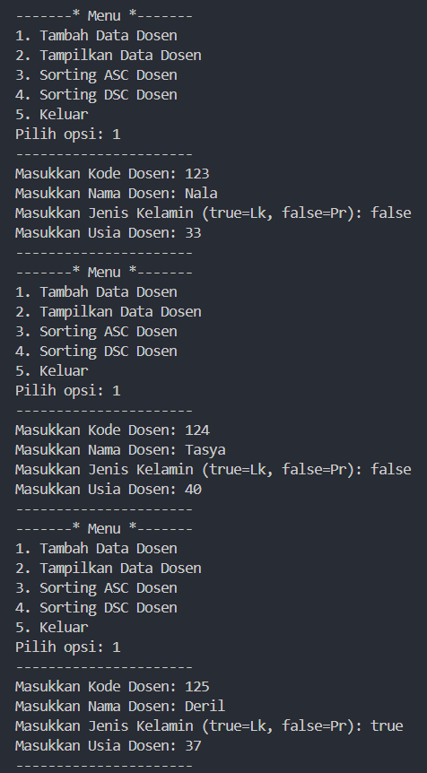
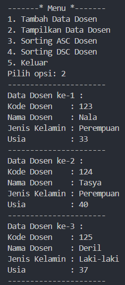
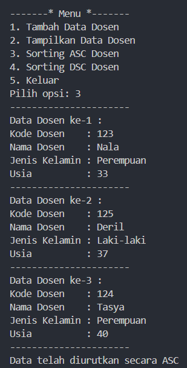
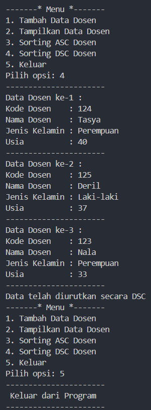
