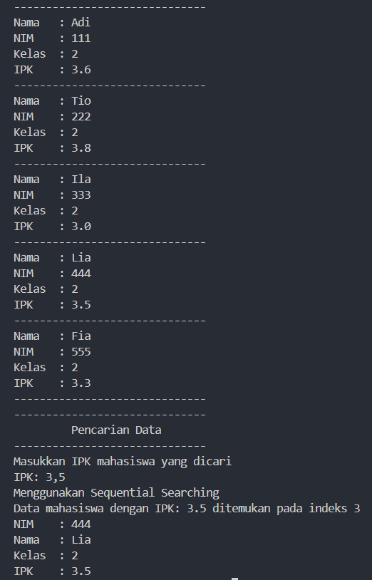

|  | Algorithm and Data Structure |
|--|--|
| NIM |  244107020038|
| Nama |  Nayla Akas Oktavia|
| Kelas | TI - 1H |
| Repository | [link] () |

# Jobsheet 7 - SEARCHING
## Percobaan 1: Searching Menggunakan Algoritma Sequential Search

berikut merupakan hasil running dari percobaan 1:

*Jawaban Pertanyaan:* 
1. Method tampilPosisi() untuk menampilkan posisi (indeks) dari suatu data, sedangkan method tampilDataSearch() untuk menampilkan detail lengkap dari data yang sudah dicari posisinya berdasarkan IPK

2. Untuk menghentikan perulangan ketika data yang dicari sudah ditemukan

## Percobaan 2: Searching Menggunakan Binary Search

berikut merupakan hasil running dari percobaan 2:

*Jawaban Pertanyaan:*

1. 

2. 

3. Tidak, karena binary search membagi rentang pencarian menjadi dua bagian. Algoritma ini mengasumsikan bahwa data yang dicari sudah terurut dalam sebuah array. Jika data tidak terurut, asumsi bahwa elemen di tengah array membagi data menjadi dua bagian terurut tidak lagi berlaku

4. Hasil tidak sesuai, ganti pada bagian else if (listMhs[mid].ipk < cari), berikut adalah outputnya: 

5.

# Latihan
berikut hasil running latihan:

