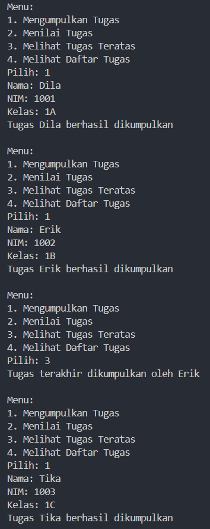
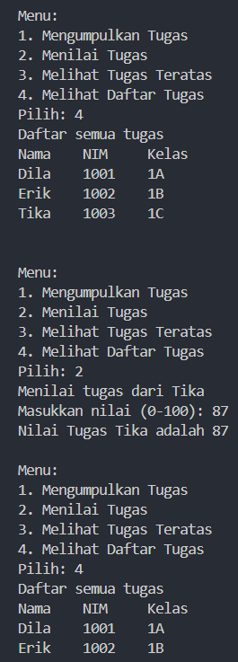
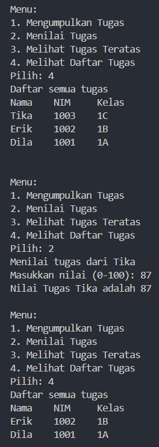
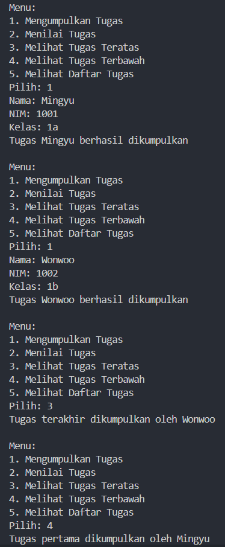
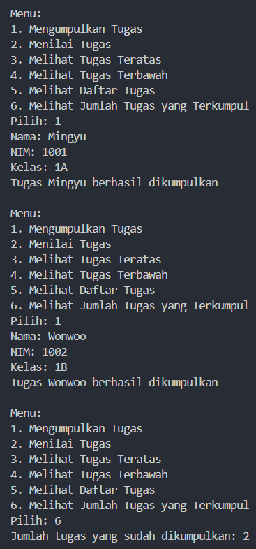
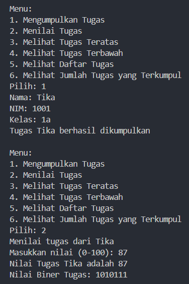
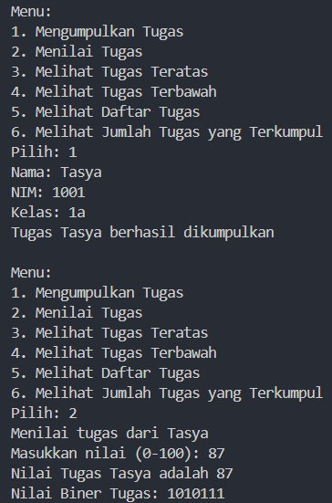
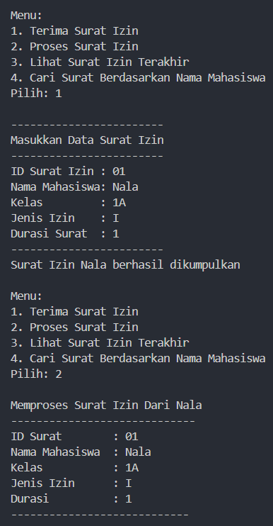
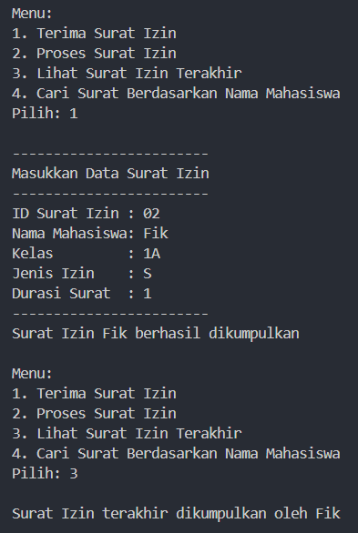
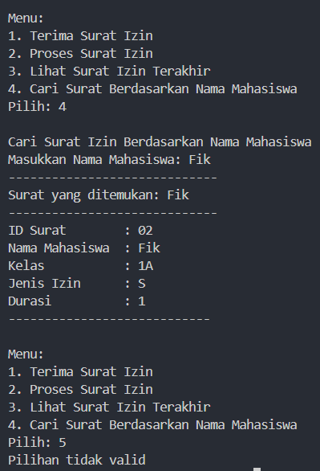

|  | Algorithm and Data Structure |
|--|--|
| NIM |  244107020038|
| Nama |  Nayla Akas Oktavia|
| Kelas | TI - 1H |
| Repository | [link] (https://github.com/naylaakas/ALSD/tree/main/jobsheet9) |

# Jobsheet 9 - STACK
## Percobaan 1: Mahasiswa Mengumpulkan Tugas

berikut merupakan hasil running dari percobaan 1:





*Jawaban Pertanyaan:* 
1. Modifikasi kode program di class ```StackTugasMahasiswa``` pada method ```print``` menjadi ```for (int i = top; i >= 0; i--)```



2. Data tugas mahasiswa yang dapat ditampung adalah lima, dapat dilihat pada kode program berikut ```StackTugasMahasiswa21 stack = new StackTugasMahasiswa21(5);```

3. Pengecekan kondisi ```!isFull()``` untuk memeriksa apakah jumlah elemen dalam stack telah mencapai kapasitas maksimumnya. Jika if else dihapus akan menyebabkan index out of bounds exception dan stack overflow

4. Menambah case pada class ```MahasiswaDemo```
```java
case 4:
    Mahasiswa21 cek = stack.peekBot();
    if (cek != null) { 
        System.out.println("Tugas pertama dikumpulkan oleh " + cek.nama);
    }
    break;
```
Menambah method ```peekBot``` di class ```StackTugasMahasiswa```
```java
public Mahasiswa21 peekBot() {
        if (!isEmpty()) {
            return stack[0];
        }
        else {
            System.out.println("Stack kosong! Tidak ada tugas yang dikumpulkan.");
            return null;
        }
    }
```



5. Menambah case pada class ```MahasiswaDemo```
```java
case 6:
    int hitung = stack.hitungTugas();
    System.out.println("Jumlah tugas yang sudah dikumpulkan: " + hitung);
    break;
```
Menambah method ```hitungTugas``` di class ```StackTugasMahasiswa```
```java
public int hitungTugas() {
        return top + 1;
    }
```



6. Commit dan push ke Github

## Percobaan 2: Konversi Nilai Tugas ke Biner

berikut merupakan hasil running dari percobaan 2:



*Jawaban Pertanyaan:*

1. Method ```konversiDesimalKeBiner``` digunakan untuk mengonversi bilangan desimal menjadi bilangan biner. Method tersebut menerima satu parameter yaitu ```nilai```, di dalam method ada sebuah objek ```StackKonversi``` untuk menyimpan sisa pembagian saat proses konversi. Proses konversinya yaitu selama ```nilai``` lebih besar dari nol, maka nilai tersebut dibagi 2 dan sisa pembagian disimpan ke dalam stack, lalu update ```nilai``` menjadi nilai hasil pembagian. Proses ini diulang sampai nilai menjadi nol. Kemudian, setelah semua digit biner disimpan dalam stack, sebuah string kosong ```biner``` diinisialisasikan. Selama stack tidak kosong, digit biner diambil dari stack dan ditambahkan ke string ```biner``` sampai stack kosong. Pengambilan dari stack dilakukan secara terbalik, sehingga digit biner yang dihasilkan akan terurut dengan benar. Setelah semua digit ditambahkan ke string ```biner```, string tersebut akan dikembalikan sebagai hasil dari method. 

2. hasil:



hasilnya tidak berubah secara fungsional, karena mempunyai konteks yang sama yaitu perulangan akan terus berlangsung jika ```nilai``` memiliki nilai tidak nol.

# Latihan
berikut hasil running latihan:







